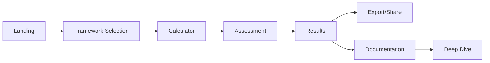

# 📚 Navigation & Menu Structure Guide

## Overview
This guide defines the standardized navigation structure for all 50+ frameworks in the AI Architecture Audit platform.

## 🎯 Core Principles

### 1. **Consistency**
- All frameworks follow the same 9-tab structure
- Uniform naming conventions
- Predictable user experience

### 2. **Progressive Disclosure**
- Start with assessment/discovery
- Move to analysis and planning
- End with roadmap/implementation

### 3. **Mobile-First**
- Tab navigation on desktop
- Accordion/carousel on mobile
- Touch-optimized interactions

## 📊 Standard Calculator Structure

### Universal 9-Tab Pattern
Every framework calculator MUST include these 9 tabs in order:

```
1. 📊 Assessment/Discovery    - Current state evaluation
2. 👥 Skills/Team Analysis    - Human capability assessment
3. 🎯 Use Case/Prioritization - Business value identification
4. 💾 Data/Technical Readiness - Technical prerequisites
5. 🏗️ Infrastructure/Platform  - Technology evaluation
6. 💰 ROI/Cost Analysis        - Financial assessment
7. 🏢 Vendor/Tool Selection    - Solution comparison
8. ⚠️ Risk Assessment          - Risk identification & mitigation
9. 🗓️ Implementation Roadmap   - Phased delivery plan
```

### Tab Implementation

```html
<!-- Calculator Tab Navigation -->
<div class="nav-tabs">
    <button class="nav-tab active" data-tab="assessment">
        📊 Maturity Assessment
    </button>
    <button class="nav-tab" data-tab="skills">
        👥 Skills Gap Analysis
    </button>
    <!-- ... remaining 7 tabs -->
</div>

<!-- Tab Content Panels -->
<div class="tab-content">
    <div id="assessment-tab" class="tab-panel active">
        <!-- Assessment content -->
    </div>
    <!-- ... remaining panels -->
</div>
```

## 📖 Documentation Structure

### Standard Documentation Hierarchy

```markdown
# Framework Name Documentation

## 1. Overview
- Executive Summary
- Business Value
- Target Audience
- Prerequisites

## 2. Getting Started
- Quick Start Guide (5 min)
- First Assessment
- Understanding Results
- Next Steps

## 3. Framework Concepts
- Core Principles
- Maturity Model
- Scoring Methodology
- Industry Standards

## 4. Module Deep Dives
- Module 1: [Name] - Detailed Guide
- Module 2: [Name] - Detailed Guide
- ... (all 9 modules)

## 5. Best Practices
- Do's and Don'ts
- Common Patterns
- Anti-patterns
- Industry Benchmarks

## 6. Case Studies
- Enterprise Implementation
- SMB Implementation
- Lessons Learned
- ROI Results

## 7. Resources
- Excel Templates
- Checklists
- Reference Architectures
- Further Reading

## 8. Support
- FAQ
- Troubleshooting
- Community Forum
- Contact
```

## 🎨 UI/UX Guidelines

### Desktop Navigation
```css
/* Tab Navigation */
.nav-tabs {
    display: flex;
    overflow-x: auto;
    gap: 1rem;
    border-bottom: 2px solid #e2e8f0;
}

.nav-tab {
    padding: 1rem 1.5rem;
    white-space: nowrap;
    border-bottom: 3px solid transparent;
}

.nav-tab.active {
    border-bottom-color: #6366f1;
    color: #6366f1;
}
```

### Mobile Navigation
```css
/* Mobile Accordion */
@media (max-width: 768px) {
    .nav-tabs {
        flex-direction: column;
    }

    .nav-tab {
        width: 100%;
        text-align: left;
        border-left: 3px solid transparent;
        border-bottom: none;
    }
}
```

## 🔄 Navigation Flow

### Typical User Journey



### Progressive Completion

1. **Linear Path** (Recommended for first-time users)
   - Complete tabs 1-9 in sequence
   - Each tab unlocks insights for the next
   - Progress indicator shows completion

2. **Expert Path** (For experienced users)
   - Jump to any tab directly
   - Skip optional sections
   - Focus on critical assessments

## 📱 Responsive Behavior

### Breakpoints
- **Desktop**: > 1024px - Full tab navigation
- **Tablet**: 768px - 1024px - Compressed tabs with icons
- **Mobile**: < 768px - Accordion or bottom sheet

### Mobile-Specific Features
- Swipe between tabs
- Progress dots indicator
- Collapsible sections
- Bottom navigation for key actions

## 🔗 Cross-Framework Navigation

### Framework Comparison
Users should be able to:
- Compare similar frameworks side-by-side
- Switch between related frameworks easily
- See framework relationships

### Suggested Frameworks
Based on current framework, suggest:
- Complementary assessments
- Next logical steps
- Related frameworks

## 📊 Menu Metadata

### Framework Categories

```javascript
const categories = {
    "AI & Machine Learning": ["ai-readiness", "mlops-audit", "llm-framework"],
    "Cloud & Infrastructure": ["cloud-migration", "well-architected", "kubernetes"],
    "Security & Compliance": ["security-audit", "genai-security", "zero-trust"],
    "Data & Analytics": ["data-governance", "data-quality", "analytics"],
    "DevOps & Automation": ["devsecops", "cicd", "gitops"],
    "Digital Transformation": ["agile", "api-strategy", "microservices"]
};
```

### Complexity Levels

```javascript
const complexity = {
    "beginner": {
        time: "20-30 min",
        prerequisites: "Basic understanding",
        color: "#10b981"  // Green
    },
    "intermediate": {
        time: "30-45 min",
        prerequisites: "Some experience required",
        color: "#f59e0b"  // Orange
    },
    "advanced": {
        time: "45-60 min",
        prerequisites: "Expert knowledge needed",
        color: "#ef4444"  // Red
    }
};
```

## 🚀 Implementation Checklist

### For Each New Framework

- [ ] Create 9 calculator tabs following standard structure
- [ ] Implement progress tracking
- [ ] Add input validation
- [ ] Create results visualization
- [ ] Enable data export (Excel/PDF)
- [ ] Write documentation following template
- [ ] Add to navigation config
- [ ] Test on mobile devices
- [ ] Add to catalog page
- [ ] Create launch announcement

## 📈 Future Enhancements

### Phase 1 (Current)
- Static navigation
- Manual framework addition
- Basic filtering

### Phase 2 (Next Quarter)
- Dynamic menu generation
- AI-powered recommendations
- Advanced search

### Phase 3 (Future)
- Personalized navigation
- Role-based menus
- Custom frameworks

## 🔧 Technical Implementation

### Adding a New Framework

1. **Update Navigation Config**
```javascript
// docs/assets/js/navigation-config.js
categories['Your Category'].frameworks.push({
    id: 'new-framework',
    name: 'New Framework Name',
    icon: '🎯'
});
```

2. **Create Calculator Page**
```bash
cp calculators/template calculators/new-framework
# Edit index.html with framework specifics
```

3. **Create Documentation**
```bash
cp docs/template docs/new-framework
# Edit index.html with documentation
```

4. **Update Catalog**
```html
<!-- Add framework card to catalog.html -->
<div class="framework-card" data-category="category" data-level="level">
    <!-- Framework details -->
</div>
```

## 📞 Support

For questions about navigation structure:
- Review this guide
- Check existing implementations
- Contact the architecture team

---

*Last Updated: September 2025*
*Version: 1.0*